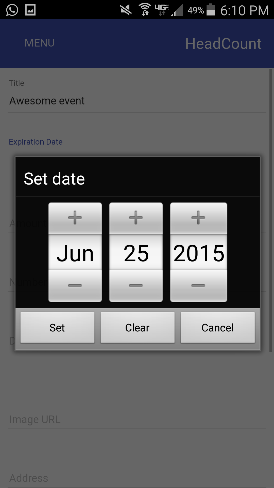
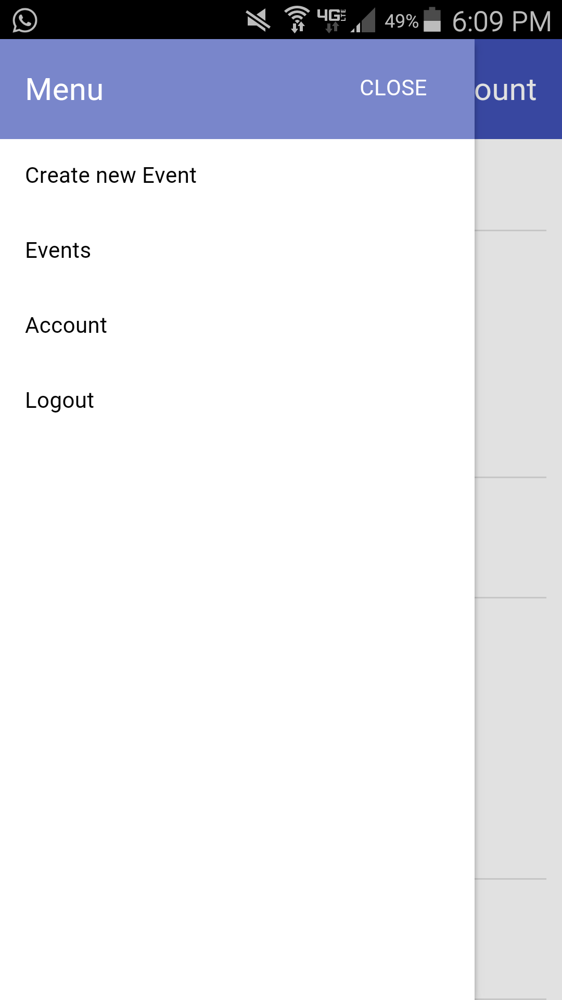

# Headcount
Goal funding app for friends to automatically split the cost with Venmo after everyone agrees to chip in.

# Web version
http://www.theheadcount.com/
 

# Mobile version
Compatible with iOS and Android
 

# Public use of this app has been deprecated
For security reasons, the Venmo developer account used to authorize this application has been deactivated and the database tables have been dropped. Setting up the application with your own developer account should be fairly painless. Good luck!

# Venmo Oauth
Using the Venmo authentication requires a couple different steps (see https://developer.venmo.com/docs/oauth). First, anyone with a regular Venmo account needs to access his/her development tab, where the required client ID and client secret keys can be found. These must be used in routes/index.js (line ~250) to redirect the user to the correct Venmo endpoint to allow the user to authorize a Venmo account with Headcount. Additionally, the base url for the application (currently http:/www.theheadcount.com/) must be entered in the Venmo development panel to allow for successful redirects.
